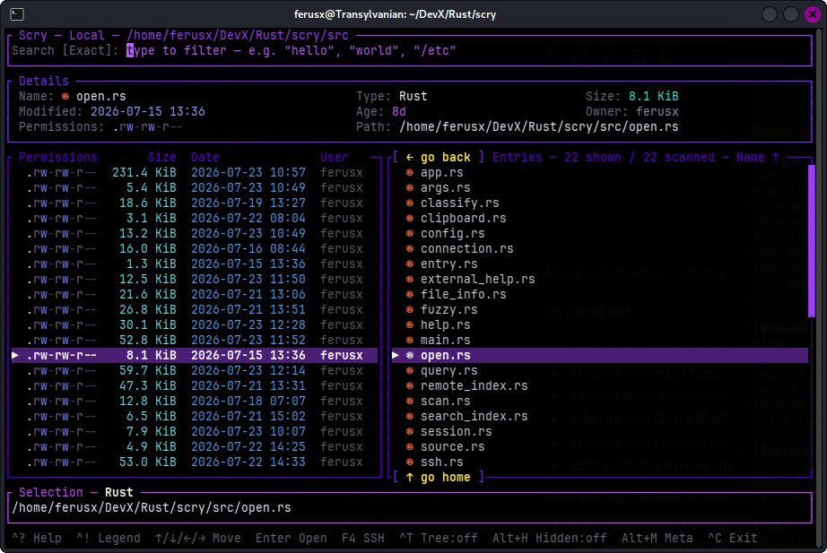
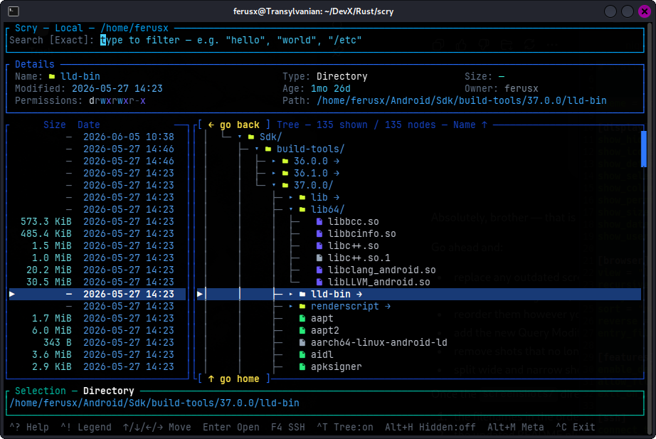
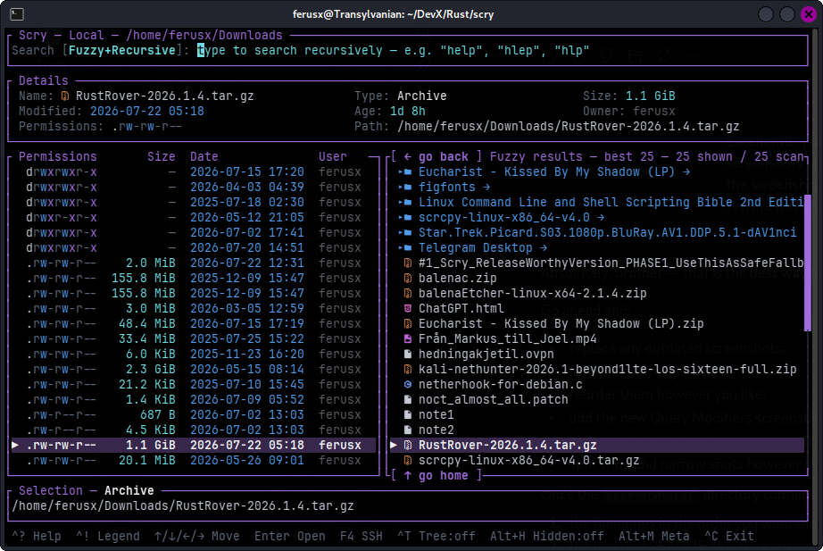
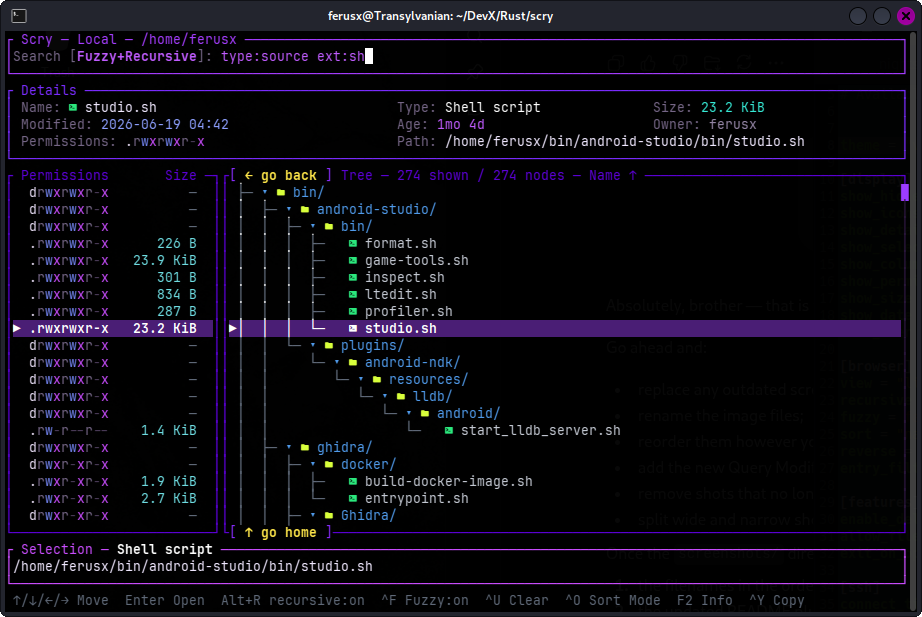
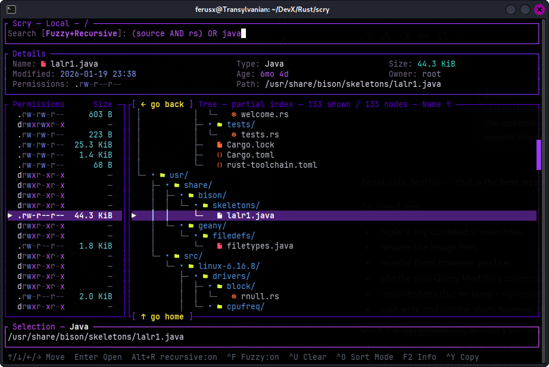
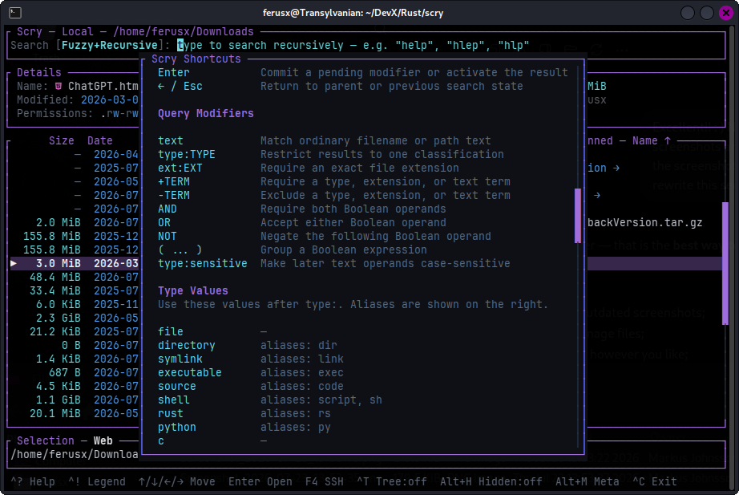
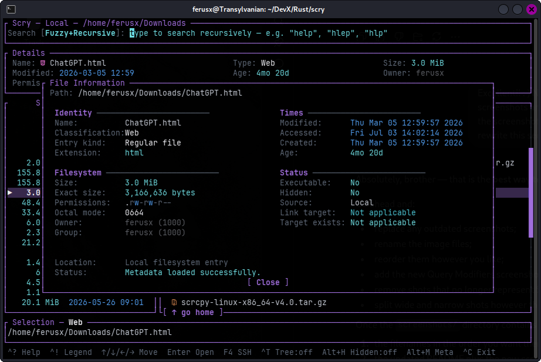
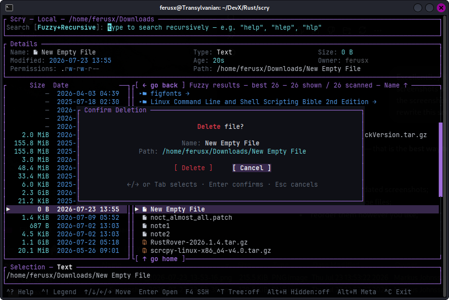
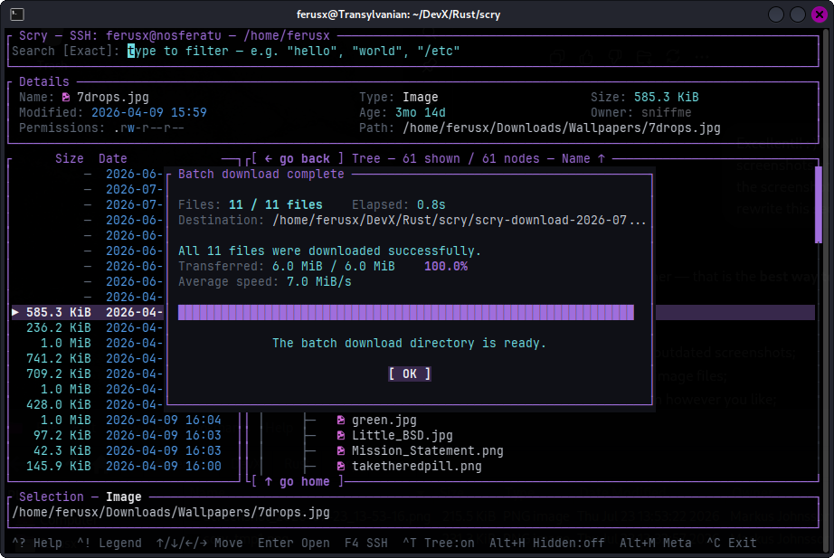
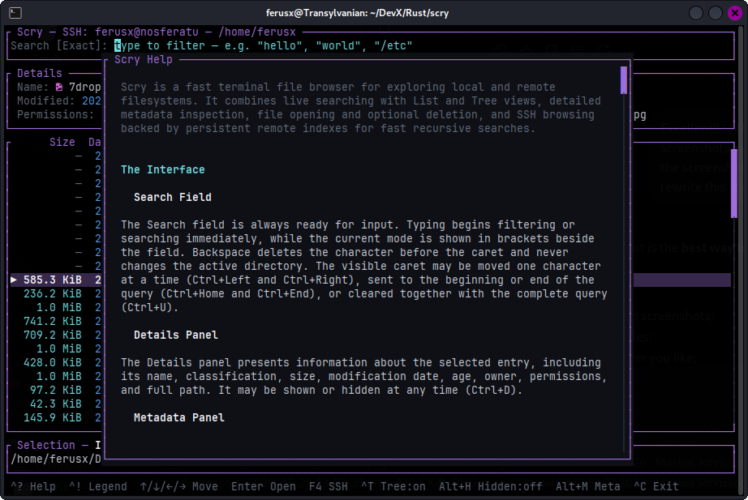

# Scry TUI File Browser

> **Project status: unreleased**
>
> Scry is under active development and has not yet published a stable release.
> Interfaces, configuration fields, shortcuts, and stored data formats may still
> change before the first release.

**Scry** is a fast, richly featured terminal file browser, recursive finder, and
SSH/SFTP filesystem explorer written in Rust. It combines responsive List and
Tree navigation, Exact and Fuzzy searching, a structured Boolean query language,
detailed metadata inspection, configurable presentation, persistent sessions,
remote indexing, and safe file-transfer workflows inside a polished terminal
interface.

> Scrying through files, locally or across the network.

## Features

### Browsing and interface

- Fast local filesystem browsing
- Remote filesystem browsing through SSH and SFTP
- List and expandable Tree views
- Keyboard-first navigation with extensive mouse support
- Foldable Details, Selection, and Metadata panels
- Independently toggleable Permissions, Size, Date, and User columns
- Adaptive metadata widths
- Optional file and directory icons
- Configurable themes with safe built-in fallbacks
- Compact contextual footer hints
- Timed information and error notifications
- Built-in Help, Shortcut Legend, About, and File Information windows

### Search and classification

- Exact, Fuzzy, Recursive, and Fuzzy+Recursive searching
- Live filtering of filenames and complete paths
- Background local recursive scans with progressive results
- Bounded best-match ranking for large Fuzzy result sets
- Query modifiers using `type:`, `ext:`, `+`, and `-`
- Boolean expressions using `AND`, `OR`, `NOT`, and parentheses
- Case-sensitive text operands through `type:sensitive`
- Parser-backed in-app reference containing every supported `type:` value and alias
- Broad source-language and file-category classification
- Query match highlighting across multiple terms
- Files-only and directories-only result filtering

### SSH and remote workflows

- OpenSSH-backed remote connections
- Saved SSH connection profiles
- Support for usernames, custom ports, identity files, and starting directories
- Persistent remote indexes for fast recursive searching
- Standard and Include Hidden remote-index policies
- Background index construction with progress reporting
- Private local caching for opened remote files
- Safe `.scry-part` temporary files and byte-count validation
- Transfer progress with bytes, percentage, elapsed time, and speed
- SSH-only multi-file marking with persistent marks
- Batch downloads with aggregate progress and completion summaries
- Flat batch-download layout by default
- Optional remote hierarchy preservation with `--preserve-hierarchy`
- Safe duplicate-name disambiguation during flattened downloads

### Files, sessions, and configuration

- Detailed File Information window with extended metadata
- Local file opening through terminal programs or desktop-default applications
- Optional keep-open or exit-after-open behavior
- Optional local deletion with confirmation and path-safety checks
- Persistent local and SSH session restoration
- Restored directories, selection, viewport, query, modes, panels, sorting, and SSH marks
- Configurable startup behavior through `scry.toml`
- Documented configuration generation with `--generate-config`
- Concise external help through `--help`
- Complete printable manual through `--manual`
- Linux and FreeBSD support

## Screenshots

### Local browsing

Scry presents filesystem entries alongside adaptive metadata columns, detailed
selection information, optional file icons, sorting state, and contextual
controls.

<p align="center">
  
</p>

### Tree view and themes

Tree mode displays expandable filesystem branches while preserving the Details,
Metadata, and Selection panels. Scry's complete interface may also be recolored
through custom themes.

<p align="center">
  
</p>

### Fuzzy and recursive searching

Fuzzy+Recursive mode searches complete directory trees while ranking the most
useful approximate matches.

<p align="center">
  
</p>

### Structured query modifiers

Query modifiers may restrict results by classification and extension while
working naturally inside Tree mode.

<p align="center">
  
</p>

### Boolean query language

Advanced searches support `AND`, `OR`, `NOT`, parentheses, compact modifiers,
and case-sensitive text operands.

<p align="center">
  
</p>

### Complete query reference

The in-app Shortcut Legend includes every supported query form, every accepted
`type:` value, and all aliases. The reference is generated from the same
definitions used by the parser.

<p align="center">
  
</p>

### File Information

The File Information window provides extended identity, filesystem, timestamp,
status, ownership, permission, and source metadata without leaving the browser.

<p align="center">
  
</p>

### Safe deletion

Local deletion is optional and disabled by default. When enabled, Scry presents
a confirmation dialog containing the selected entry's name and full path.

<p align="center">
  
</p>

### SSH batch downloads

Marked remote files may be downloaded together. The final summary reports the
file count, destination, transferred bytes, elapsed time, average speed, and
overall result.

<p align="center">
  
</p>

### Built-in Help

The scrollable Help window explains Scry's interface, navigation, searching,
remote workflows, file operations, sessions, and configuration in detail.

<p align="center">
  
</p>

## Building

Scry currently has no published release package. Build it directly from the
source repository with a recent stable Rust toolchain:

```sh
git clone https://github.com/ferusx/scry-tui-file-browser.git
cd scry-tui-file-browser
cargo build --release
```

The optimized binary will be available at:

```text
target/release/scry
```

Run it directly:

```sh
./target/release/scry
```

Or install it into Cargo's binary directory:

```sh
cargo install --path .
```

During development, the debug binary can be built and run with:

```sh
cargo build
target/debug/scry
```

### Icon font

Scry's optional file and directory icons use Nerd Font glyphs. For the intended
appearance, configure the terminal emulator to use a
[Nerd Font](https://www.nerdfonts.com/)-compatible font.

Icons may be enabled or disabled at runtime with `F3` and through
`show_icons` in `scry.toml`. Scry remains fully usable without icon support.

## Usage

```text
scry [OPTIONS] [PATH]
```

`PATH` selects the local or remote starting location. Without a path, local
browsing begins in the process's current directory. With `--ssh`, an omitted
path or `.` opens the remote account's home directory.

Examples:

```sh
# Browse the current directory
scry

# Browse a specific directory
scry ~/Projects

# Start in Tree mode with permissions and sizes
scry -T -p -s ~/Projects

# Start with a recursive Exact listing
scry --recursive ~

# Start with Fuzzy and Recursive search enabled
scry --recursive --fuzzy ~

# Start with a prepared query
scry --recursive --query "type:source index -target" ~/Projects

# Restrict startup results to files and symbolic links
scry --files-only ~/Downloads

# Restrict startup results to directories
scry --dirs-only ~/Projects

# Browse a remote host through SSH/SFTP
scry --ssh user@example-host

# Browse a specific remote directory
scry --ssh user@example-host /var/log

# Restore the most recently saved session
scry --restore-session

# Preserve remote paths during marked batch downloads
scry --ssh user@example-host --preserve-hierarchy

# Print concise command-line help
scry --help

# Print the complete explanatory manual
scry --manual

# Generate a documented configuration template
scry --generate-config
```

## Help and manual

Scry provides three complementary documentation routes:

- `scry --help` prints a concise command-line reference and startup examples.
- `scry --manual` prints the complete explanatory manual used by the F1 Help
  window. Its output is suitable for pagers, redirection, and text editors.
- `Ctrl+!` opens the in-app Shortcut Legend, including the complete query
  modifier and `type:` alias reference.

Examples:

```sh
scry --manual | less
scry --manual > scry-manual.txt
scry --manual | bat
```

## Searching

Typing directly into the Search field begins filtering immediately. Queries may
match filenames or complete relative paths.

Scry provides four closely related search modes:

- **Exact** filters the active directory using literal text matching.
- **Fuzzy** ranks approximate filename and path-component matches.
- **Recursive** searches all descendants beneath the active root.
- **Fuzzy+Recursive** combines recursive scope with fuzzy relevance ranking.

Switch between Exact and Fuzzy matching with `Ctrl+F`. Toggle recursive scope
with `Alt+R`.

Exact searching treats multiple ordinary unsigned words as one phrase. Fuzzy
searching recognizes exact matches, prefixes, substrings, compact
abbreviations, missing characters, small typing mistakes, and adjacent
transpositions. For example, both `hlp` and `hlep` may locate `help`.

Local recursive scans run in the background and publish Exact results
progressively. Fuzzy searches retain the strongest 500 ranked matches, keeping
the interface responsive even when the underlying corpus contains hundreds of
thousands or millions of entries.

Recursive Tree mode retains a bounded Exact result set for safe hierarchy
construction, while ordinary Exact List mode remains unlimited.

The query caret may be moved with `Left` and `Right`, sent to the
beginning or end with `Ctrl+Home` and `Ctrl+End`, and cleared together with the
complete query using `Ctrl+U`.

## Query language

Scry supports both a compact query syntax and advanced Boolean expressions.

Open the in-app Shortcut Legend with `Ctrl+!` for the complete parser-backed
reference containing every supported query form, every accepted `type:` value,
and all aliases.

### Ordinary text

Ordinary text matches filenames and paths:

```text
wallpaper
source index
/etc
```

Searching is case-insensitive by default.

### Type modifiers

Use `type:` to restrict results by classification:

```text
type:directory
type:source
type:python
type:asm
type:image
```

The full list includes filesystem kinds, programming languages, source and
build files, archives, packages, documents, media, databases, certificates,
disk images, plugins, text, binary, and unknown files.

Type filters may be combined with ordinary text:

```text
type:source index
type:python parser
type:image wallpaper
```

### Extension modifiers

Use `ext:` when the actual file extension must match:

```text
ext:jpg
ext:.rs
type:image ext:tif
```

A leading dot is optional. Unlike ordinary text, an extension modifier does not
match arbitrary occurrences elsewhere in the path.

### Required and excluded terms

Prefix a term with `+` to require it or `-` to exclude it:

```text
+python
-java
+.jpg
-.cache
```

Signed terms are resolved in this order:

1. known file type or programming language;
2. known file extension;
3. ordinary filename or path text.

Positive classification and extension terms form an accepted-type group, while
positive ordinary text terms remain cumulative. Any matching negative term
excludes the entry.

Examples:

```text
type:source +rust -target parser
ext:jpg -.cache holiday
+python +lua
-index -test
```

### Boolean expressions

Advanced searches may use `AND`, `OR`, `NOT`, and parentheses:

```text
rust AND test
rust OR python
type:source AND NOT target
(rust OR python) AND test
```

Operators are case-insensitive, although uppercase makes longer expressions
easier to read.

Boolean precedence is:

1. `NOT`
2. `AND`
3. `OR`

Therefore:

```text
rust OR python AND test
```

is interpreted as:

```text
rust OR (python AND test)
```

Parentheses override the default precedence.

Compact operands remain valid inside Boolean expressions:

```text
type:source AND (rust OR cpp)
ext:jpg AND NOT .cache
+rs OR +cpp
rs AND -test
```

### Case-sensitive operands

Use `type:sensitive` to make later textual operands case-sensitive:

```text
type:sensitive README
rust OR type:sensitive Makefile
```

The directive affects textual operands appearing after it. Type and extension
classifications remain normalized.

### Pending modifiers and incomplete expressions

A trailing `+`, `-`, `type:`, or `ext:` term remains pending while it is being
typed and does not repeatedly disturb the current result set.

Modifiers and Boolean expressions are evaluated live as they are typed. Incomplete
forms remain harmless until they become valid. `Enter` is reserved for activating
the selected entry.

Incomplete Boolean expressions such as these are harmless during live typing:

```text
rust OR
(
NOT
```

They begin filtering only after they form a valid expression.

## Command-line options

| Option | Description |
|---|---|
| `-h`, `--help` | Print concise command-line help |
| `--manual` | Print the complete Scry manual |
| `-V`, `--version` | Print the Scry version |
| `--generate-config` | Generate `scry.toml.generated` and exit |
| `--restore-session` | Restore the most recently saved browser session |
| `--ssh TARGET` | Browse a remote computer through SSH/SFTP |
| `--preserve-hierarchy` | Preserve remote paths during marked batch downloads |
| `-a`, `--all` | Show hidden files and directories |
| `-r`, `--recursive` | Start with a recursive listing |
| `--fuzzy` | Start in Fuzzy search mode |
| `--query TEXT` | Start with `TEXT` in the Search field |
| `--files-only` | Show files and symbolic links only |
| `--dirs-only` | Show directories only |
| `-T`, `--tree` | Start in Tree mode |
| `--no-open` | Do not open selected files externally |
| `--exit-on-open` | Exit after successfully opening a file |
| `-p`, `--permissions` | Show the Permissions column |
| `-s`, `--size` | Show the Size column |
| `-d`, `--date` | Show the Date column |
| `-u`, `--user` | Show the User column |

`--files-only` and `--dirs-only` are mutually exclusive.

`--no-open` and `--exit-on-open` are mutually exclusive.

Command-line options override corresponding values from `scry.toml` and restored
session state for the current launch.

## Keyboard and mouse

Press `Ctrl+!` inside Scry to open the complete Shortcut Legend. Press `F1` to
open the full internal Help.

Some important controls:

| Shortcut | Action |
|---|---|
| `↑` / `↓` | Move the selection |
| `PgUp` / `PgDn` | Move one visible page |
| `Home` / `End` | Select the first or last entry |
| `Ctrl+←` / `Esc` | Move to the parent or collapse a Tree branch |
| `Ctrl+→` | Enter a directory or expand a Tree branch |
| `Enter` | Open the selected file or establish a Tree directory as the new root |
| `Left` / `Right` | Move the query caret |
| `Ctrl+Home` / `Ctrl+End` | Move the caret to the beginning or end |
| `Ctrl+T` | Switch between List and Tree views |
| `Ctrl+F` | Switch between Exact and Fuzzy search |
| `Alt+R` | Toggle recursive searching |
| `Ctrl+O` | Cycle the sort mode |
| `Ctrl+R` | Reverse the sort direction |
| `Ctrl+U` | Clear the current query |
| `Ctrl+D` | Toggle the Details panel |
| `Ctrl+S` | Toggle the Selection panel |
| `Alt+M` | Toggle the Metadata panel |
| `Alt+H` | Toggle hidden entries |
| `F3` | Toggle file and directory icons |
| `F4` | Open the SSH Connection window |
| `F5` | Open the Remote Index Builder |
| `F7` | Toggle the Permissions column |
| `F8` | Toggle the Size column |
| `F9` | Toggle the Date column |
| `F10` | Toggle the User column |
| `Alt+A` | Open About Scry |
| `Ctrl+!` | Open the Shortcut Legend |
| `Ctrl+C` | Exit |

Mouse support includes wheel scrolling, left-click selection, double-click
activation, middle-click paste clipboard, clickable controls where
available, and draggable scrollbars.

## SSH and remote files

Scry browses remote filesystems through OpenSSH and SFTP. It supports hostnames,
SSH aliases, usernames, custom ports, identity files, starting directories, and
saved connection profiles.

Open the Connection window with `F4`. Profiles contain:

- profile name;
- host;
- username;
- port;
- identity file;
- starting directory.

Profiles are stored locally and may be saved, selected, connected, deleted, or
reused from the same window. Disconnect returns Scry to the preserved local
session.

Remote directories behave much like local directories and may be browsed in
List or Tree mode. Remote files must first be transferred into Scry's private
local cache before they can be opened.

The transfer window reports transferred bytes, total size, percentage, elapsed
time, and average speed. Downloads use temporary `.scry-part` files so an
interrupted transfer cannot be mistaken for a complete cached file. Completed
transfers and errors remain visible until acknowledged.

Examples:

```sh
scry --ssh nosferatu
scry --ssh ferusx@nosferatu
scry --ssh ferusx@nosferatu:2222
```

## Persistent remote index

Recursive SSH searching uses a persistent host index instead of repeatedly
asking SFTP to traverse the complete remote filesystem for every query.

When recursive search is first requested, Scry can build an index from `/`.
The Remote Index Builder may also be opened manually with `F5`.

Two indexing policies are available:

- **Standard** records ordinary files and directories.
- **Include dot-entries** also records entries whose names begin with a dot.

Index construction runs independently in the background while Scry remains
available for browsing. Progress is reported as entries are written. The
completed index is stored locally and automatically reused on later connections
to the same host, account, and port.

The complete index represents the remote filesystem from `/`, while the active
remote directory defines which part of that index is searched. Volatile system
trees such as `/proc`, `/sys`, `/dev`, and `/run` are skipped.

Compatible older indexes remain usable after Scry upgrades. Rebuilding may be
necessary to record newly introduced language and file classifications.

## Opening files

Directories are entered directly by pressing `Enter` or the `Ctrl+Right` arrow key. Executable files are launched in a terminal,
while ordinary files are opened through the desktop's default application. Text
files may fall back to a terminal editor when no suitable desktop opener is
available.

Remote files are first materialized in Scry's local cache and are then opened in
the same way as local files.

## Deletion

Deletion is disabled by default and must be explicitly enabled in `scry.toml`.
It is currently available only for local files and directories.

Every deletion request opens a confirmation window with Cancel selected by
default. Ordinary files and symbolic links are removed directly. Directories and
their contents are removed recursively. Symbolic links are removed as links and
are never followed into their targets.

Scry refuses unsafe targets such as the filesystem root, the active browsing
root, and paths outside the permitted root. Confirmed deletion is permanent and
does not use a desktop trash or recovery area.

Enable it with:

```toml
[features]
enable_deletion = true
```

## Configuration

Scry reads its startup configuration from:

```text
~/.config/scry/scry.toml
```

When `XDG_CONFIG_HOME` is set, Scry uses:

```text
$XDG_CONFIG_HOME/scry/scry.toml
```

The configuration file controls display defaults, browser behavior, optional
features, theme selection, and SSH timeouts. Command-line options override the
corresponding configuration values for the current launch.

Missing files are created with safe defaults. Malformed configuration files,
unknown browser modes, invalid sort modes, and unsafe timeout values fall back
to built-in defaults rather than preventing Scry from starting.

Example:

```toml
theme = "default"

[display]
show_hidden = false
show_icons = true
show_details = true
show_selection = true
show_columns = true
show_permissions = false
show_size = true
show_date = true
show_user = false

[browser]
view = "list"
recursive = false
fuzzy = false
sort = "name"
reverse = false
entry_filter = "all"

[features]
enable_deletion = true
allow_file_opening = true
exit_on_open = false

[ssh]
connect_timeout_seconds = 10
server_alive_interval_seconds = 15
preserve_hierarchy = false
```

## Themes

Scry supports external TOML themes selected through `scry.toml`. Theme files may
define colors for interface frames, ordinary files and directories, detailed
file classifications, selections, messages, permission characters, icons,
scrollbars, and other interface elements.

Missing themes, malformed files, absent color groups, and invalid individual
color values fall back safely to Scry's built-in palette. A broken theme cannot
prevent the application from starting. In such an event, the application will start with the default theme loaded.

## Platform support

Scry is being developed and tested on:

- Linux
- FreeBSD

Other Unix-like systems may work but have not yet been tested as thoroughly.

## Project status

Scry is under active development. The following major systems are functional:

- local List and Tree browsing;
- exact, fuzzy, recursive, and fuzzy-recursive searching;
- rich query modifiers and source-language classification;
- background local scans and bounded fuzzy ranking;
- SSH/SFTP browsing and saved connection profiles;
- persistent indexed recursive searching over SSH;
- remote file transfers and private local caching;
- configurable metadata, icons, startup defaults, and themes;
- local deletion with confirmation and path-safety checks;
- internal Help, Shortcut Legend, and About windows;
- keyboard and mouse operation.

Current refinement work is focused on further Tree-mode performance, adaptive
presentation, search highlighting, notification behavior, and additional
quality-of-life controls. Every feature covered in this file is currently working or otherwise clearly stated as not-yet-implemented.

## Acknowledgements

Scry's design has been influenced by the wider ecosystem of terminal file browsers and search tools.

Special thanks to [Broot](https://github.com/Canop/broot) for demonstrating how powerful, expressive, and visually attractive terminal filesystem navigation can be. Scry is an independent implementation with its own interface, search engine, navigation model, and feature set, but Broot has been an important source of inspiration.

Scry also builds upon the excellent Rust terminal ecosystem, including Ratatui and Crossterm.

## License

Scry is licensed under the **BSD 3-Clause License**.

```text
SPDX-License-Identifier: BSD-3-Clause
```

See [`LICENSE`](LICENSE) for the complete license text.

## Author

Created by **Markus Johnsson**.
