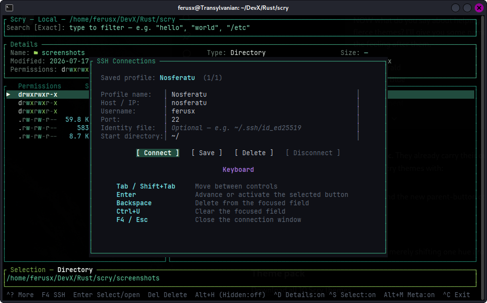
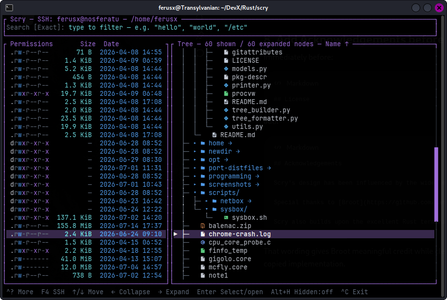
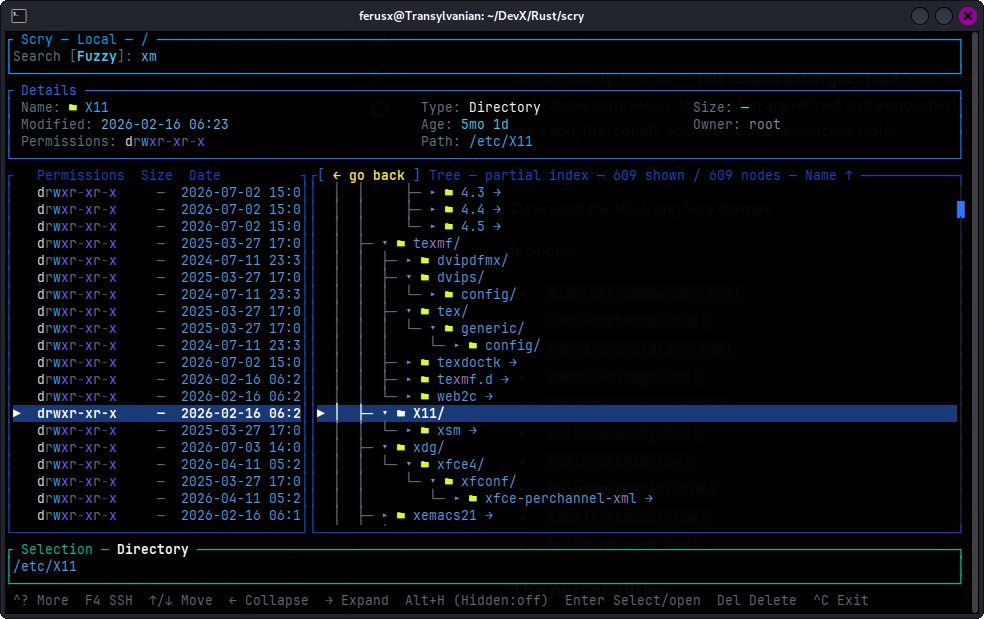
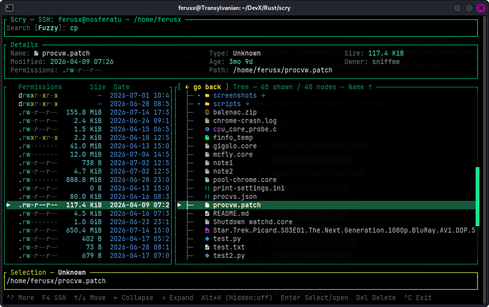
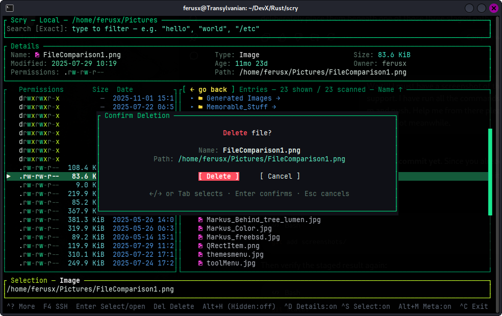

# Scry TUI File Browser

**Scry** is a fast, richly featured terminal file browser and recursive finder
written in Rust. It combines live Exact and Fuzzy searching, List and Tree
navigation, detailed file classification, configurable metadata, mouse support,
SSH/SFTP browsing, and persistent remote indexes inside a polished terminal
interface.

> Scrying through files, locally or across the network.

## Features

- Fast local filesystem browsing
- Remote filesystem browsing through SSH and SFTP
- List and expandable Tree views
- Exact, Fuzzy, Recursive, and Fuzzy+Recursive searching
- Live filtering of filenames and complete paths
- Rich query modifiers using `type:`, `ext:`, `+`, and `-`
- Broad source-language and file-category classification
- Persistent SSH indexes for fast remote recursive searching
- Background remote index construction with Standard and Include Hidden policies
- Sorting by name, size, modification date, or type
- Reversible sort direction
- Colored Unix permission display
- File size, owner, date, type, age, permissions, and full-path details
- Foldable Details, Selection, and Metadata panels
- Independently toggleable Permissions, Size, Date, and User columns
- Optional file and directory icons
- Saved SSH connection profiles
- Remote file transfers with byte counts, percentage, elapsed time, speed, caching, and safe partial files
- Local file opening through terminal programs or desktop-default applications
- Optional local deletion with confirmation and path-safety checks
- Mouse selection, wheel scrolling, double-click activation, middle-click navigation, and draggable scrollbars
- Configurable startup behavior through `scry.toml`
- Configurable themes with safe built-in fallbacks
- Built-in Help, Shortcut Legend, and About windows
- Compact contextual footer hints
- Linux and FreeBSD support

## Screenshots

### Local browsing

<p align="center">
  
  
</p>

### Tree view

<p align="center">
  
</p>

### SSH browsing

<p align="center">
  
</p>

<p align="center">
  
</p>

### Shortcuts and About

<p align="center">
  
  
</p>

### Scry themed up

<p align="center">
  
  
</p>

### Deletion support

<p align="center">
  
</p>

## Building

Scry requires a recent Rust toolchain.

```sh
git clone https://github.com/ferusx/scry-tui-file-browser.git
cd scry-tui-file-browser
cargo build --release
```

The compiled binary will be available at:

```text
target/release/scry
```

Run it directly:

```sh
./target/release/scry
```

Or install it into Cargo's binary directory:

```sh
cargo install --path .
```

### Icon font

Scry's optional file-type icons use Nerd Font glyphs. For the intended appearance, configure your terminal emulator to use a [Nerd Font](https://www.nerdfonts.com/)-compatible font.

Icons can be enabled or disabled at runtime with `F3`. Scry remains fully usable without them.

## Usage

```text
scry [OPTIONS] [PATH]
```

Examples:

```sh
# Browse the current directory
scry

# Browse a specific directory
scry ~/Projects

# Start in Tree mode with permissions and sizes
scry -T -p -s ~/Projects

# Start with a recursive listing
scry -r ~

# Browse a remote host through SSH/SFTP
scry --ssh user@example-host
```

## Searching

Type directly into Scry's Search field to begin filtering. Queries update live,
and may match both filenames and paths. Searching is case-insensitive by default.

Scry provides four closely related search modes:

- **Exact** filters the current directory using literal text matching.
- **Fuzzy** ranks approximate filename and path-component matches.
- **Recursive** searches all descendants beneath the active directory.
- **Fuzzy+Recursive** combines recursive scope with fuzzy relevance ranking.

Press `Ctrl+F` to switch between Exact and Fuzzy matching. Press `Alt+R` to
enable or disable recursive scope.

Exact searching treats multiple ordinary words as one text phrase. Fuzzy
searching supports exact matches, prefixes, substrings, compact abbreviations,
missing characters, small typing mistakes, and adjacent transpositions. For
example, both `hlp` and `hlep` may locate `help`.

Local recursive scans run in the background and publish results progressively.
Fuzzy searches retain only the strongest 500 ranked matches, keeping the
interface responsive even when the underlying tree is very large. Fuzzy results
are ordered by relevance rather than by the selected ordinary sort mode.

The visible query caret can be moved with `Ctrl+Left` and `Ctrl+Right`, sent to
the beginning or end with `Ctrl+Home` and `Ctrl+End`, and cleared together with
the complete query using `Ctrl+U`.

## Query modifiers

Scry's query language can combine ordinary text with classifications,
extensions, required terms, and exclusions.

### Type modifiers

Use `type:` to restrict results by file classification:

```text
type:directory
type:source
type:python
type:asm
type:image
```

General categories such as `source`, `document`, `archive`, `image`, `audio`,
`video`, `config`, and `database` are supported alongside dedicated programming
language classifications.

A type modifier may be combined with ordinary text:

```text
type:source index
type:python parser
type:image wallpaper
```

### Extension modifiers

Use `ext:` when the actual extension must match:

```text
ext:jpg
ext:.rs
type:image ext:tif
```

A leading dot is optional. Unlike ordinary text, an extension modifier does not
match arbitrary occurrences elsewhere in the path.

### Required and excluded terms

Prefix a term with `+` to require it, or with `-` to exclude it:

```text
+python
-java
+.jpg
-.cache
```

Signed terms are resolved in this order:

1. known file type or programming language;
2. known file extension;
3. ordinary filename or path text.

Every positive term must match. A match against any negative term excludes the
entry.

Modifiers and ordinary text may be combined:

```text
type:source +rust -target parser
ext:jpg -.cache holiday
```

### Pending modifiers

A trailing `+`, `-`, `type:`, or `ext:` term remains pending while it is being
typed and does not repeatedly disturb the current result set. Press `Space` to
begin another term, or `Enter` to commit the pending modifier.

The first `Enter` commits a pending modifier. A subsequent `Enter` performs the
normal action on the selected entry.

## Command-line options

| Option | Description |
|---|---|
| `-h`, `--help` | Print help information |
| `-V`, `--version` | Print the Scry version |
| `--ssh TARGET` | Browse a remote computer through SSH/SFTP |
| `-a`, `--all` | Show hidden files and directories |
| `-r`, `--recursive` | Start with a recursive listing |
| `-T`, `--tree` | Start in Tree mode |
| `-p`, `--permissions` | Show the permissions column |
| `-s`, `--size` | Show the file-size column |
| `-d`, `--date` | Show the modification-date column |
| `-u`, `--user` | Show the owner column |

Command-line options override corresponding startup values from `scry.toml`.
Run `scry --help` for the complete built-in command-line reference.

## Keyboard and mouse

Press `Ctrl+!` inside Scry to open the complete Shortcut Legend. Press `F1` to
open the full internal Help.

Some important controls:

| Shortcut | Action |
|---|---|
| `↑` / `↓` | Move the selection |
| `PgUp` / `PgDn` | Move one visible page |
| `Home` / `End` | Select the first or last entry |
| `←` / `Esc` | Move to the parent or collapse a Tree branch |
| `→` | Enter a directory or expand a Tree branch |
| `Enter` | Open the selected file or establish a Tree directory as the new root |
| `Ctrl+Left` / `Ctrl+Right` | Move the query caret |
| `Ctrl+Home` / `Ctrl+End` | Move the caret to the beginning or end |
| `Ctrl+T` | Switch between List and Tree views |
| `Ctrl+F` | Switch between Exact and Fuzzy search |
| `Alt+R` | Toggle recursive searching |
| `Ctrl+O` | Cycle the sort mode |
| `Ctrl+R` | Reverse the sort direction |
| `Ctrl+U` | Clear the current query |
| `Ctrl+D` | Toggle the Details panel |
| `Ctrl+S` | Toggle the Selection panel |
| `Alt+M` | Toggle the Metadata panel |
| `Alt+H` | Toggle hidden entries |
| `F3` | Toggle file and directory icons |
| `F4` | Open the SSH Connection window |
| `F5` | Open the Remote Index Builder |
| `F7` | Toggle the Permissions column |
| `F8` | Toggle the Size column |
| `F9` | Toggle the Date column |
| `F10` | Toggle the User column |
| `Alt+A` | Open About Scry |
| `Ctrl+!` | Open the Shortcut Legend |
| `Ctrl+C` | Exit |

Mouse support includes wheel scrolling, left-click selection, double-click
activation, middle-click parent or collapse behavior, clickable controls where
available, and draggable scrollbars.

## SSH and remote files

Scry browses remote filesystems through OpenSSH and SFTP. It supports hostnames,
SSH aliases, usernames, custom ports, identity files, starting directories, and
saved connection profiles.

Open the Connection window with `F4`. Profiles contain:

- profile name;
- host;
- username;
- port;
- identity file;
- starting directory.

Profiles are stored locally and may be saved, selected, connected, deleted, or
reused from the same window. Disconnect returns Scry to the preserved local
session.

Remote directories behave much like local directories and may be browsed in
List or Tree mode. Remote files must first be transferred into Scry's private
local cache before they can be opened.

The transfer window reports transferred bytes, total size, percentage, elapsed
time, and average speed. Downloads use temporary `.scry-part` files so an
interrupted transfer cannot be mistaken for a complete cached file. Completed
transfers and errors remain visible until acknowledged.

Examples:

```sh
scry --ssh nosferatu
scry --ssh ferusx@nosferatu
scry --ssh ferusx@nosferatu:2222
```

## Persistent remote index

Recursive SSH searching uses a persistent host index instead of repeatedly
asking SFTP to traverse the complete remote filesystem for every query.

When recursive search is first requested, Scry can build an index from `/`.
The Remote Index Builder may also be opened manually with `F5`.

Two indexing policies are available:

- **Standard** records ordinary files and directories.
- **Include Hidden** also records entries whose names begin with a dot.

Index construction runs independently in the background while Scry remains
available for browsing. Progress is reported as entries are written. The
completed index is stored locally and automatically reused on later connections
to the same host, account, and port.

The complete index represents the remote filesystem from `/`, while the active
remote directory defines which part of that index is searched. Volatile system
trees such as `/proc`, `/sys`, `/dev`, and `/run` are skipped.

Compatible older indexes remain usable after Scry upgrades. Rebuilding may be
necessary to record newly introduced language and file classifications.

## Opening files

Directories are entered directly. Executable files are launched in a terminal,
while ordinary files are opened through the desktop's default application. Text
files may fall back to a terminal editor when no suitable desktop opener is
available.

Remote files are first materialized in Scry's local cache and are then opened in
the same way as local files.

## Deletion

Deletion is disabled by default and must be explicitly enabled in `scry.toml`.
It is currently available only for local files and directories.

Every deletion request opens a confirmation window with Cancel selected by
default. Ordinary files and symbolic links are removed directly. Directories and
their contents are removed recursively. Symbolic links are removed as links and
are never followed into their targets.

Scry refuses unsafe targets such as the filesystem root, the active browsing
root, and paths outside the permitted root. Confirmed deletion is permanent and
does not use a desktop trash or recovery area.

Enable it with:

```toml
[features]
enable_deletion = true
```

## Configuration

Scry reads its startup configuration from:

```text
~/.config/scry/scry.toml
```

When `XDG_CONFIG_HOME` is set, Scry uses:

```text
$XDG_CONFIG_HOME/scry/scry.toml
```

The configuration file controls display defaults, browser behavior, optional
features, theme selection, and SSH timeouts. Command-line options override the
corresponding configuration values for the current launch.

Missing files are created with safe defaults. Malformed configuration files,
unknown browser modes, invalid sort modes, and unsafe timeout values fall back
to built-in defaults rather than preventing Scry from starting.

Example:

```toml
theme = "default"

[display]
show_hidden = false
show_details = true
show_selection = true
show_columns = true
show_permissions = false
show_size = false
show_date = false
show_user = false

[browser]
view = "list"
recursive = false
sort = "name"
reverse = false

[features]
enable_deletion = false

[ssh]
connect_timeout_seconds = 10
server_alive_interval_seconds = 15
```

## Themes

Scry supports external TOML themes selected through `scry.toml`. Theme files may
define colors for interface frames, ordinary files and directories, detailed
file classifications, selections, messages, permission characters, icons,
scrollbars, and other interface elements.

Missing themes, malformed files, absent color groups, and invalid individual
color values fall back safely to Scry's built-in palette. A broken theme cannot
prevent the application from starting.

## Platform support

Scry is being developed and tested on:

- Linux
- FreeBSD

Other Unix-like systems may work but have not yet been tested as thoroughly.

## Project status

Scry is under active development. The following major systems are functional:

- local List and Tree browsing;
- exact, fuzzy, recursive, and fuzzy-recursive searching;
- rich query modifiers and source-language classification;
- background local scans and bounded fuzzy ranking;
- SSH/SFTP browsing and saved connection profiles;
- persistent indexed recursive searching over SSH;
- remote file transfers and private local caching;
- configurable metadata, icons, startup defaults, and themes;
- local deletion with confirmation and path-safety checks;
- internal Help, Shortcut Legend, and About windows;
- keyboard and mouse operation.

Current refinement work is focused on further Tree-mode performance, adaptive
presentation, search highlighting, notification behavior, and additional
quality-of-life controls.

## Acknowledgements

Scry's design has been influenced by the wider ecosystem of terminal file browsers and search tools.

Special thanks to [Broot](https://github.com/Canop/broot) for demonstrating how powerful, expressive, and visually attractive terminal filesystem navigation can be. Scry is an independent implementation with its own interface, search engine, navigation model, and feature set, but Broot has been an important source of inspiration.

Scry also builds upon the excellent Rust terminal ecosystem, including Ratatui and Crossterm.

## License

Scry is licensed under the **BSD 3-Clause License**.

```text
SPDX-License-Identifier: BSD-3-Clause
```

See [`LICENSE`](LICENSE) for the complete license text.

## Author

Created by **Markus Johnsson**.
