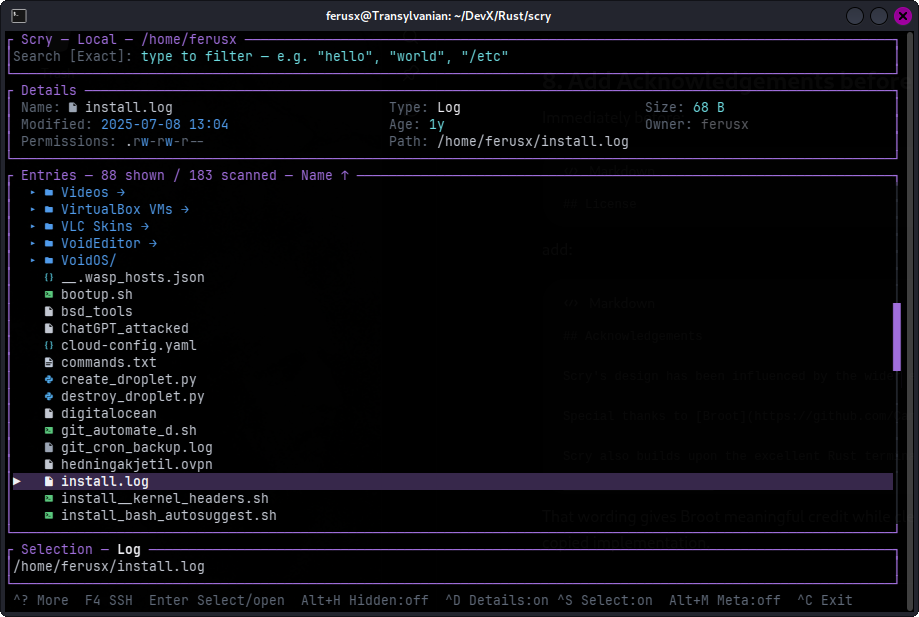
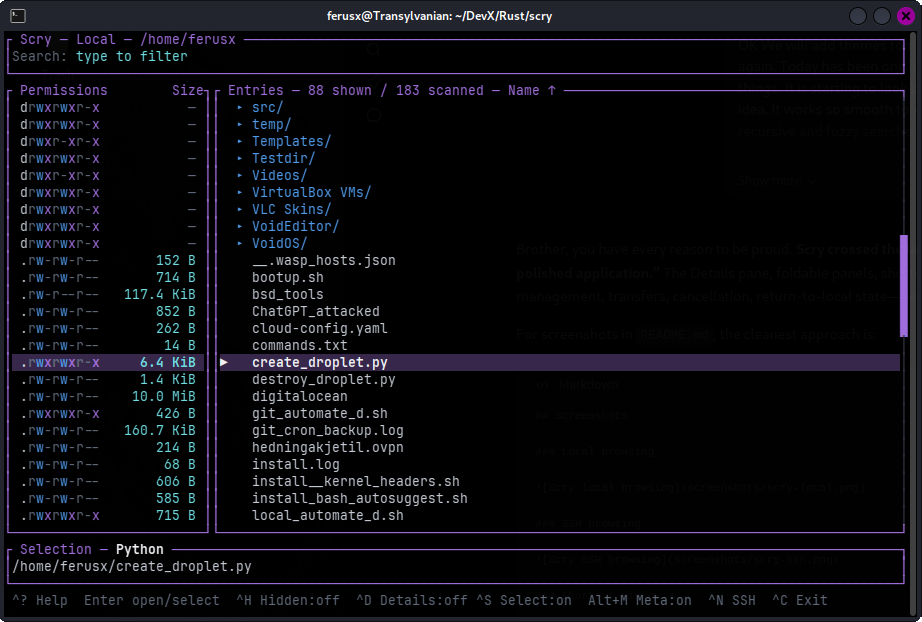
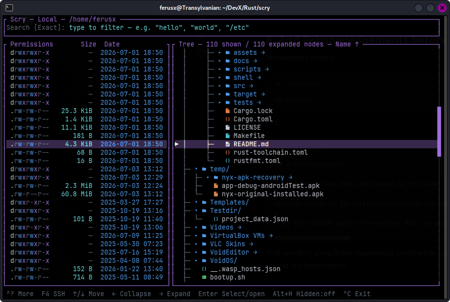
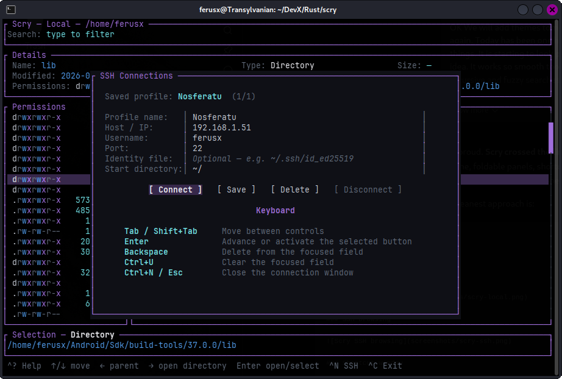
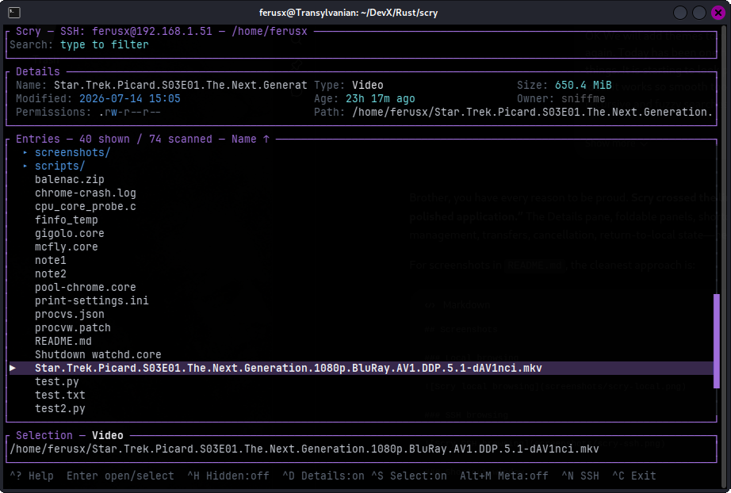
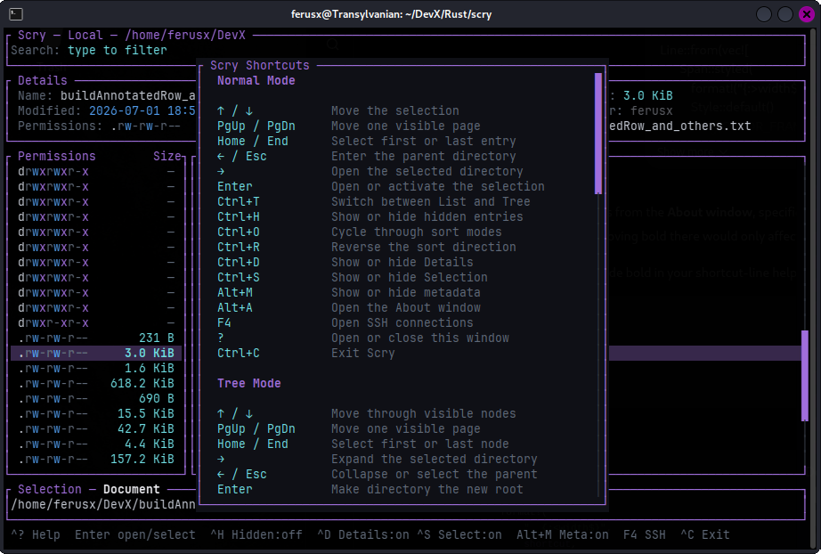
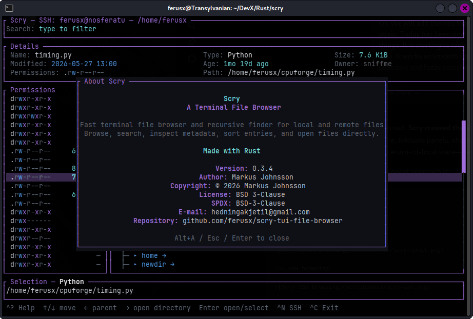

# Scry TUI File Browser

**Scry** is a stylish, fast terminal file browser and recursive finder written in Rust. It combines keyboard-first navigation, mouse support, rich metadata, expandable tree browsing, exact and fuzzy search, colored file-type icons, and SSH/SFTP access in a polished terminal interface.

> Scrying through files, locally or across the network.

## Features

- Fast local filesystem browsing
- Remote browsing through SSH/SFTP
- List and expandable Tree views
- Exact and fuzzy search modes
- Recursive search as you type
- Typo-aware fuzzy matching with abbreviation and transposition support
- Bounded fuzzy results retaining the best 500 matches
- Responsive background scanning and cancellable fuzzy workers
- Context-preserving recursive Tree results with expandable branches
- Selection preservation when switching search and recursive modes
- Sorting by name, size, modification date, or type
- Reversible sort order
- Colored Nerd Font file-type icons in List, Tree, and Details views
- Runtime icon toggle
- Colored Unix permission display
- File size, owner, date, type, age, and path details
- Foldable Details, Selection, and Metadata panels
- Mouse selection, scrolling, double-click activation, and draggable scrollbars
- Remote file transfer with progress, speed, cancellation, caching, and safe temporary files
- Saved SSH connection profiles
- Built-in shortcut reference and About window
- Keyboard-first operation with compact contextual footer hints
- Theme support planned

## Screenshots

### Local browsing

<p align="center">
  
  
</p>

### Tree view

<p align="center">
  
</p>

### SSH browsing

<p align="center">
  
</p>

<p align="center">
  
</p>

### Shortcuts and About

<p align="center">
  
  
</p>

## Building

Scry requires a recent Rust toolchain.

```sh
git clone https://github.com/ferusx/scry-tui-file-browser.git
cd scry-tui-file-browser
cargo build --release
```

The compiled binary will be available at:

```text
target/release/scry
```

Run it directly:

```sh
./target/release/scry
```

Or install it into Cargo's binary directory:

```sh
cargo install --path .
```

### Icon font

Scry's optional file-type icons use Nerd Font glyphs. For the intended appearance, configure your terminal emulator to use a [Nerd Font](https://www.nerdfonts.com/)-compatible font.

Icons can be enabled or disabled at runtime with `F3`. Scry remains fully usable without them.

## Usage

```text
scry [OPTIONS] [PATH]
```

Examples:

```sh
# Browse the current directory
scry

# Browse a specific directory
scry ~/Projects

# Start in Tree mode with permissions and sizes
scry -T -p -s ~/Projects

# Start with a recursive listing
scry -r ~

# Browse a remote host through SSH/SFTP
scry --ssh user@example-host
```

## Search

Type directly in Scry to begin searching. Search results update as the query changes.

Scry provides four closely related modes:

- **Exact** filters entries using literal case-insensitive text matching.
- **Fuzzy** ranks approximate filename and path-component matches.
- **Recursive** searches all descendants beneath the current root.
- **Fuzzy+Recursive** combines approximate matching with recursive discovery.

Press `Ctrl+F` to switch between Exact and Fuzzy matching, and `Alt+R` to toggle persistent recursive mode.

Fuzzy matching supports:

- exact and prefix matches
- substring matches
- compact ordered abbreviations
- common typing mistakes
- adjacent character transpositions

For large trees, Scry builds a compact shared search index and performs fuzzy ranking in a background worker. Only the best 500 matches are retained, keeping memory use and interface updates bounded even when hundreds of thousands of entries are scanned.

Directories remain grouped above files, and Scry attempts to preserve the selected path when search modes or recursive scope are changed.

## Command-line options

| Option | Description |
|---|---|
| `-h`, `--help` | Print help information |
| `-V`, `--version` | Print the Scry version |
| `--ssh TARGET` | Browse a remote computer through SSH/SFTP |
| `-a`, `--all` | Show hidden files and directories |
| `-r`, `--recursive` | Start with a recursive listing |
| `-T`, `--tree` | Start in Tree mode |
| `-p`, `--permissions` | Show the permissions column |
| `-s`, `--size` | Show the file-size column |
| `-d`, `--date` | Show the modification-date column |
| `-u`, `--user` | Show the owner column |

## Keyboard and mouse

Press `?` inside Scry to open the complete, scrollable shortcut reference.

Some important controls:

| Shortcut | Action |
|---|---|
| `↑` / `↓` | Move the selection |
| `PgUp` / `PgDn` | Move one visible page |
| `Home` / `End` | Select the first or last entry |
| `←` / `Esc` | Move to the parent or collapse a branch |
| `→` | Enter a directory or expand a branch |
| `Enter` | Open or activate the selected entry |
| `Ctrl+T` | Switch between List and Tree views |
| `Ctrl+F` | Switch between Exact and Fuzzy search |
| `Alt+R` | Toggle recursive mode |
| `Ctrl+O` | Cycle sort mode |
| `Ctrl+R` | Reverse sort order |
| `Ctrl+U` | Clear the current search |
| `Ctrl+D` | Toggle the Details panel |
| `Ctrl+S` | Toggle the Selection panel |
| `Alt+M` | Toggle the Metadata panel |
| `Alt+H` | Toggle hidden entries |
| `F3` | Toggle file-type icons |
| `F4` | Open SSH connections |
| `Alt+A` | Open About Scry |
| `?` | Open the shortcut reference |
| `Ctrl+C` | Exit |

Mouse support includes wheel scrolling, left-click selection, double-click activation, right-click parent/collapse behavior, and draggable scrollbars.

## SSH and remote files

Scry can browse remote filesystems through OpenSSH and SFTP. It supports hostnames, SSH aliases, usernames, custom ports, identity files, start directories, and saved connection profiles. Remote directories can be navigated in both List and Tree views, with the same metadata, classification, icon, sorting, and file-opening interface used for local browsing.

When a remote file is opened, Scry transfers it into a private local cache and shows real progress information, including bytes transferred, percentage, elapsed time, and transfer speed. Transfers can be cancelled safely. Incomplete `.scry-part` files are removed, and completed cache files are validated before publication.

Examples:

```sh
scry --ssh nosferatu
scry --ssh ferusx@nosferatu
scry --ssh ferusx@nosferatu:2222
```

> Recursive scanning of complete remote directory trees is not yet available. Remote browsing currently loads directories on demand through SFTP.

## Platform support

Scry is being developed and tested on:

- Linux
- FreeBSD

Other Unix-like systems may work but have not yet been tested as thoroughly.

## Project status

Scry is under active development. Local browsing, exact and fuzzy recursive search, List and Tree navigation, metadata display, colored file-type icons, mouse interaction, SSH/SFTP browsing, saved connection profiles, and the remote transfer workflow are functional.

The local search engine has been optimized for large directory trees with batched background scanning, compact shared indexing, bounded best-match retention, progressive fuzzy results, worker cancellation, and selection-preserving mode transitions.

Major planned work includes:

- recursive search across remote SFTP directory trees
- external TOML theme files
- further Tree-view performance and navigation refinement
- additional UI polish and configuration options

## Acknowledgements

Scry's design has been influenced by the wider ecosystem of terminal file browsers and search tools.

Special thanks to [Broot](https://github.com/Canop/broot) for demonstrating how powerful, expressive, and visually attractive terminal filesystem navigation can be. Scry is an independent implementation with its own interface, search engine, navigation model, and feature set, but Broot has been an important source of inspiration.

Scry also builds upon the excellent Rust terminal ecosystem, including Ratatui and Crossterm.

## License

Scry is licensed under the **BSD 3-Clause License**.

```text
SPDX-License-Identifier: BSD-3-Clause
```

See [`LICENSE`](LICENSE) for the complete license text.

## Author

Created by **Markus Johnsson**.
